# Service Accounts FUNdamentals  

**Overlooked, Overprivileged, and often Under protected**  

---

## What, the who, the why?

Service accounts represent a critical blind spot in enterprise identity strategies — often overprivileged, rarely inventoried, and difficult to manage at scale.

With inconsistent naming, unclear ownership, and poor lifecycle management, service accounts are one of the hardest identity types to discover, audit, and secure in Active Directory.

The lack of centralized visibility and privilege boundaries makes service accounts prime targets — highly discoverable by attackers and rarely governed by strong controls.

---

## In Scope – Out of Scope

| In Scope | Partial | Not In Scope |
|----------|---------|--------------|
| Active Directory | Entra ID Connect / Cloud Sync | Entra ID* |

### *Entra ID

- Applications  
- Managed Identities  
- Service Principals  
- Workload Identities

---

## Types of Service Accounts

- **Virtual Accounts**
- **LocalSystem** (`NT AUTHORITY\System`)
- **sMSA** (Standalone Managed Service Account)
- **gMSA** (Group Managed Service Account)
- **dMSA** (Delegated Managed Service Accounts)
- **User Account Based**
  - Entra ID synced
  - interactive
  - kiosk
  - mailbox
  - scheduled task
  - shared mailbox
  - etc.

[Microsoft Docs: Understand Service Accounts](https://learn.microsoft.com/en-us/windows-server/identity/ad-ds/manage/understand-service-accounts)

---

### Virtual Accounts

Virtual accounts are managed local accounts that simplify service administration by providing the following benefits:

- The virtual account is automatically managed
- Service name established in the format `NT SERVICE\<SERVICENAME>`
- Access network resources by using computer account `$domain\computer$`

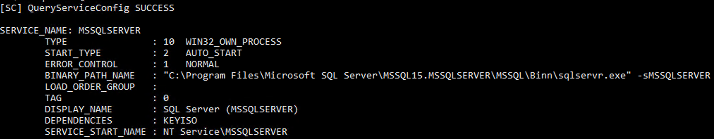

---

### LocalSystem (`NT Authority\SYSTEM`)

- Running System Services
- System Maintenance Tasks
- Scheduled Tasks
- Security Software
- Accessing Network Shares (using the computer account)
- Domain Authentication (`$domain\computer$`)

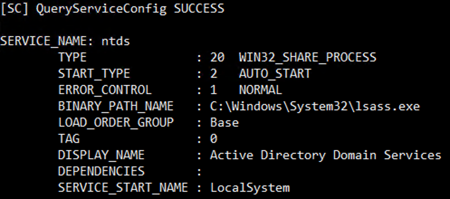

---

### Standalone Managed Service Account (sMSA)

- Introduced in Windows Server 2008 R2
- Restricted to a single machine (cannot be shared)
- Automatically managed passwords
- Automatically managed SPN
- Limited adoption due to lack of flexibility

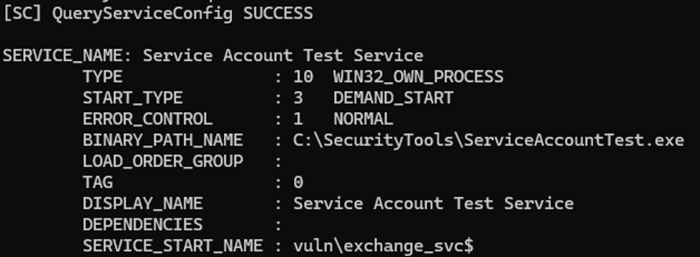

---

### Group Managed Service Account (gMSA)

- Introduced in Windows Server 2012 (enhanced in 2012 R2)
- Extension of sMSA
- Supports multiple machines (better for load-balanced services)
- Automatically managed passwords (default 30 days – too long?)
- Automatically managed SPN
- Requires Key Distribution Services (KDS) Root Key
- Access to password controlled via `ms-DS-GroupMSAMembership`

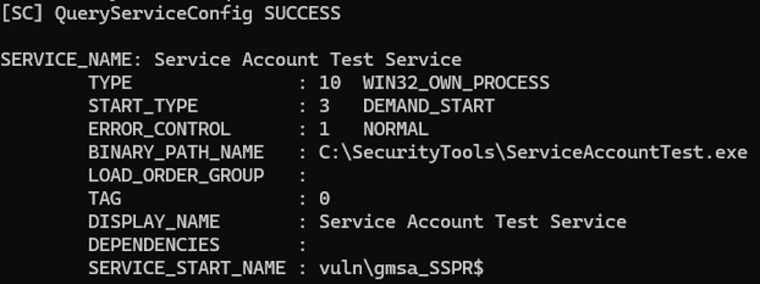

---

### Delegated Managed Service Account (dMSA)

- Introduced in Windows Server 2025
- Allows transition from traditional service accounts to machine accounts
- Linked to the device identity
- Fully managed and randomized keys
- dMSA can be used as a standalone account
- Can replace an existing standard service account (this is good!)
- Supports disabling the original service account
- Requires ALL servers to support dMSA
- NOT supported for scheduled task

---

### EVERYTHING ELSE

- Access/Device Accounts (MFD, AD auth/read)
- Entra ID synced
- Interactive Logon
- Kiosk
- Mailbox
- Scheduled Task
- Service (it runs something)
- Shared Account
- Shared Mailbox

---

## So many choices, which one to choose?

When choosing a service account, it's important to consider factors such as the level of access required by the service, the security policies in place on the server, and the specific needs of the application or service being run.

*Microsoft even have a table for this, although it appears to have an error in it – I’ve submitted a change for this to MS and it’s under review.*

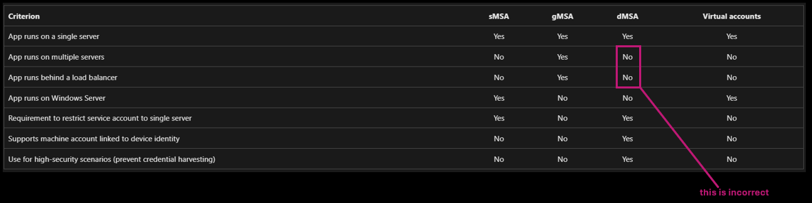

[Understand Service Accounts - Microsoft Learn](https://learn.microsoft.com/en-us/windows-server/identity/ad-ds/manage/understand-service-accounts)

---

## How Attackers Exploit Service Accounts

### Default Credentials

- Printer with default credentials
- Scan to email/File configured
- Default credentials attempt authentication
- Create an LDA server under our control
- Modify the Server IP
- Test connection
- Password sent in clear text
- Initial access or move laterally

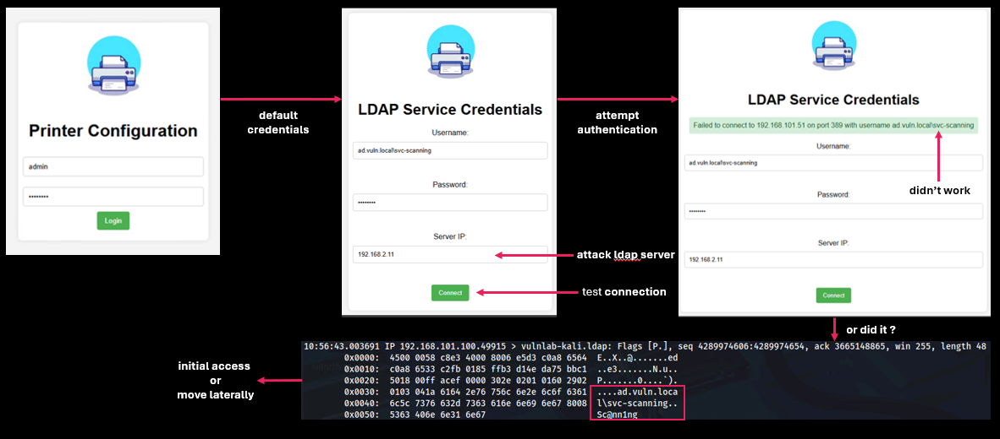

### LLMNR/Relay

- Setup responder to listen for requests and relay to impacket
- Coerce someone to test non-existent share
- Wait for service account to attempt access to non-existent server/service
- Respond & relay to target servers, move laterally

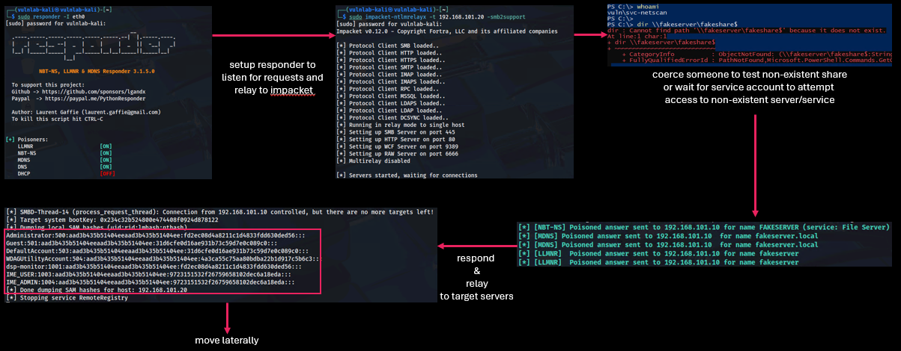

### Kerberoasting

- Identify interesting accounts with SPNs and privileges!
- Crack offline
- Request TGS ticket for service account
- Authenticate as service account (game over)

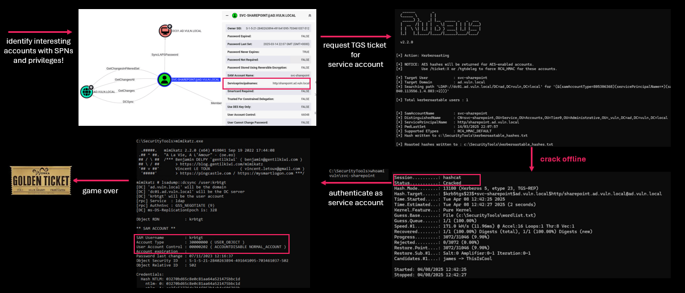

### Local Abuse

- Scheduled task running as SYSTEM
- Users with full control on script
- Authenticate as computer to the domain
- Use mimikatz to do bad stuff

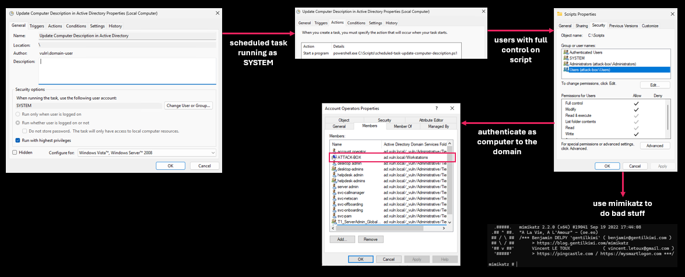

### Misconfigured Delegations

- Request TGT for gMSA
- Authenticate as gMSA
- Identify delegation issues
- Retrieve gMSA hash

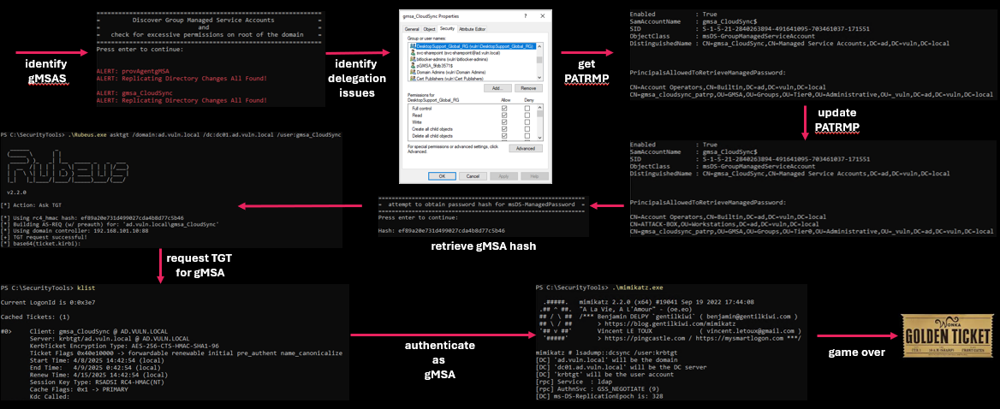

---

## Trust no one

If nothing is perfect.. then what do you do? we need to trust something, we can take steps to make sure whatever is chosen can be as secure as possible.

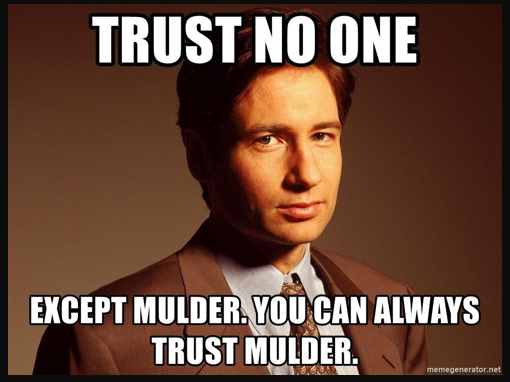

> Sometimes, nothing is perfect, but at some point, you must put your trust in something.

---

## Identifying Service Accounts

### What’s the problem: Technology or Process?


- **Process:** 60%
- **Technology:** 40%

In most cases, the challenge lies in the process. Technology helps but it’s only part of the solution.

---

### Identifying Service Accounts (WHO)

#### Querying AD

- **Accounts with Password Never Expires**

  ```powershell
  Get-ADUser -Filter {PasswordNeverExpires -eq $true} -Properties PasswordNeverExpires
  ```

- **Accounts with SPNs**

  ```powershell
  Get-ADUser -Filter {ServicePrincipalNames -like "*"} -Properties ServicePrincipalNames
  ```

- **Accounts with specific descriptions**

  ```powershell
  Get-ADUser -Filter {Description -like "*service*"} -Properties Description
  ```

- **Accounts within specific Organizational Units**

  ```powershell
  Get-ADUser -Filter * -SearchBase "OU=Service Accounts,DC=ad,DC=vuln,DC=local" -Properties *
  ```

- **Accounts trusted for delegation**

  ```powershell
  Get-ADUser -Filter {TrustedForDelegation -eq $true} -Properties TrustedForDelegation
  ```

- **Accounts with specific naming conventions (svc_*, *sa, app*, etc.)**

  ```powershell
  Get-ADUser -Filter {Name -like "svc_*" -or Name -like "*_sa" -or Name -like "app_*"} -Properties Name
  ```

- **Accounts with specific user right assignments (Logon as a batch job - locally)**

---

### Identifying Service Accounts (WHO and WHERE)

#### Log Analysis (may require collection of events from endpoint)

- **Kerberos Tickets Events**
  - 4768 A Kerberos authentication ticket (TGT) was requested
  - 4769 A Kerberos service ticket (TGS) was requested
  - 4770 A Kerberos ticket was renewed (usually TGT renewal)
  - 4771 Kerberos pre-authentication failed (often seen in brute-force or wrong password)
  - 4776 Domain controller attempted to validate credentials via NTLM (not Kerberos)
- **Logon Events**
  - 4624 An account successfully logged on
  - 4625 An account failed to log on
  - 4648 A logon was attempted using explicit credentials (e.g., RunAs)
  - 4672 Special privileges assigned to a new logon (e.g., Admins, SeDebugPrivileged)

#### SIEM Analysis

```plaintext
index=wineventlog sourcetype=WinEventLog:Security EventCode=4769 Account_Name="*svc*"
| table _time, ComputerName, Account_Name, Service_Name, Ticket_Options, IpAddress, Process_Name
```

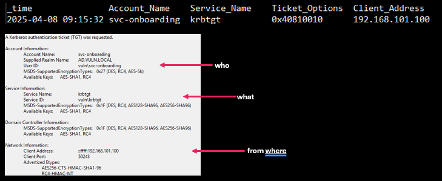

#### Endpoint Analysis

- Accounts with "Logon as a Service" (SeServiceLogonRight)
- Accounts with “Logon as Batch” (SeBatchLogonRight)
- Accounts running scheduled tasks
- Accounts running services

---

## Identifying Service Account Use (WHAT!)

Privileged AD Accounts (Account Operators etc)

- by who
- to who
- on what

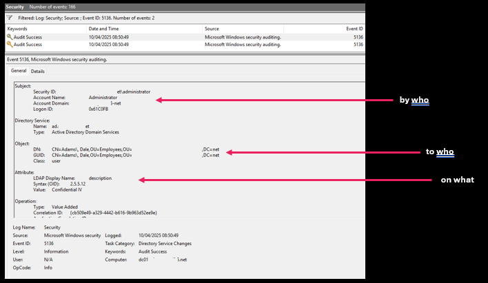

---

## Identifying Service Account Permissions (WHAT)

Look for AD specific delegations

- Active Directory/Entra ACL Analysis
- ADACL Scanner/ForestDruid/BloodHound

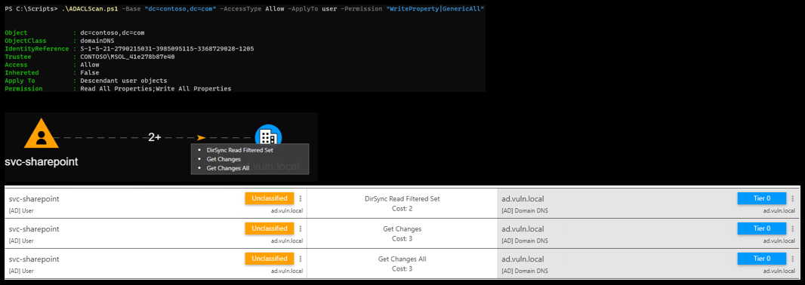

---

## Managing Service Accounts…

(just a suggestion)

---

## Naming Conventions

A great start, unfortunately, over time these get changed, the chosen prefix makes the sAMAccountName too long, it then gets truncated, or it is accidentally mistyped.

### Naming convention examples

| Use Case | Naming Convention | Identifier |
|----------|-------------------|------------|
| Exchange Online | `EXMB-xxxxxx` |exchangeMailbox|
| Exchange Resource | `EXRS-xxxxxx` |exchangeResource |
| Kiosk | `KSK-xxxxxx` |kiosk|
| Shared | `SHRD-xxxxxx` |Shared|
| Service Account | `SVC-xxxxxx` |service/serviceInteractive|
| Test | `TST-xxxxxx` |test|

---

## Setting Standards: Account Definitions

| Category | Primary Accounts | Secondary Accounts | Service Accounts | Shared Accounts | Shared Mailbox Accounts | Exchange Resource Accounts |
|----------|-----------------|-------------------|------------------|----------------|-----------------------|--------------------------|
| Password Management (PAM Controlled) | Not Applicable | Mandatory | 24 hour use window | Mandatory for business continuity | Password not automatically changed | Mandatory |
| VPN Remote Access | Permitted | Prohibited | Prohibited | Prohibited | Prohibited | Prohibited |
| Exchange Mailbox | Permitted | Prohibited | Prohibited | Prohibited | Permitted | Prohibited |
| Always Disabled | Not Required | Not Required | Not Required | Not Required | Enablement by exception only | Required |
| Logon Restrictions "LogonTo"/URA | Not Required | Not Required | Required Case by Case Basis | Not Required |Required | Required |
| Responsible for Account Creation | IGA | IT Security | IT Security | IT Security | Enterprise Messaging | Enterprise Messaging |
| Required Approvals | Human Resources | IT Security | IT Security | IT Security | Enterprise Messaging | Enterprise Messaging |
| Account Validation | N/A | Bi-Annual | Annual | Quarterly | Annual | Annual |
| Max Password Age | N/A | 24 hour use window | 12 months | 24 hour use window | 12 months | 12 months |

---

## Account Definitions (example)

| Attribute | Form/Definition | Example |
|-----------|-----------------|---------|
| User Logon Name (sAMAccountName) | SRVC-[Use-Identifier] | SRVC-MyApp |
| Employee ID (employeeID) | [Service Account Identifier] | 999999 |
| Employee Type (employeeType) | [Service Account Type Identifier] | serviceInteractive |
| Full Name (cn/name) | [User Logon Name] | SRVC-MyApp |
| Display Name (displayName) | [User Logon Name] | SRVC-MyApp |
| Description (description) | [ServiceDesk/Incident/ChangeRequest/Approval] | INC84383929 |
| Manager (manager) | [Account Owner’s Primary Account] | Wick, John |
| Account Expiration | [13 months from creation] | 2026-04-10 |
| Fine Grained Password Policy | [Account Type] | FGPP-serviceInteractive (complexity/age) |

---

## Service Account Remediation as a Project

Define Measure Analyze Improve Control

## Problem

Excessive privilege, password risks, and lack of oversight on service accounts.

## What to Measure

- Total number of service accounts
- % with non-expiring passwords
- % with Domain Admin rights
- % with interactive logon enabled
- % without description or owner metadata

## Root Causes

- Legacy app requirements
- No naming convention
- Lack of ownership tracking
- Manual provisioning with no review

## Quick Wins

- Tag all service accounts via naming or metadata
- Disable interactive logon where not required
- Rotate and set expiry on passwords
- Set up password vaulting (e.g., CyberArk, BeyondTrust)

## Sustainability

- Monthly/quarterly review of service accounts
- Monitor with change tracking or DSP alerts
- Enforce naming conventions via provisioning scripts
- Audit via GPOs, alerting, and reporting
- Onboard service accounts into your PAM solution

## Objectives

- Identify all service accounts
- Reduce overprivileged accounts
- Enforce strong password policies
- Minimize attack surface (e.g., no interactive logon)

## Tools

- PowerShell (Get-ADUser, Get-ACL, Search-ADAccount, etc.)
- Third-party tools like PingCastle, BloodHound
- SIEM
- Event Logs

## Risk Insights

- Service accounts used interactively = lateral movement risk
- Domain Admin accounts with SPNs = Kerberoasting risk
- Accounts without ownership = zero accountability

## Bigger Projects

- Migrate services to gMSAs
- Use tiered administration to limit exposure
- Implement least privilege RBAC
- Automate compliance reporting

## Scope

AD forest(s) and potentially Entra ID hybrid identities

---

## Securing Service Accounts

- **Least Privilege**

No Domain Admin access unless necessary - SPOILER: it’s almost NEVER necessary

- **PIM/PAM Managed**
- Use xMSA Instead of standard user accounts
- Fine Grained Password Policies/Authentication Policies
- Assign accountability/ownership

---

## Location, location, location

Allows for granular delegation and control over service accounts, from the highest to the least privileged. For example, any account that can reset passwords is considered Tier 0.

- `OU=Service,OU=Accounts,OU=Tier0,OU=Administrative,OU=_vuln,DC=ad,DC=vuln,DC=local`
- `OU=Service,OU=Accounts,OU=Tier1,OU=Administrative,OU=_vuln,DC=ad,DC=vuln,DC=local`
- `OU=Interactive,OU=Service,OU=Accounts,OU=Tier1,OU=Administrative,OU=_vuln,DC=ad,DC=vuln,DC=local`
- `OU=Service,OU=Accounts,OU=Tier2,OU=Administrative,OU=_vuln,DC=ad,DC=vuln,DC=local`
- `OU=Kiosk,OU=Service,OU=Accounts,OU=Tier2,OU=Administrative,OU=_vuln,DC=ad,DC=vuln,DC=local`

---

## Authentication Policies & Policy Silos

- Available since Windows Server 2012 R2
- Defines the Kerberos protocol ticket-granting ticket (TGT) lifetime properties and authentication access control conditions for an account type.
- Authentication policies control the following:
  - The TGT lifetime for the account, which is set to be non-renewable.
  - The criteria that device accounts need to meet to sign in with a password or a certificate.
  - The criteria that users and devices need to meet to authenticate to services.

[Microsoft Docs: Authentication Policies and Authentication Policy Silos](https://learn.microsoft.com/en-us/windows-server/security/credentials-protection-and-management/authentication-policies-and-authentication-policy-silos)

---

## Protected Users

What about protected users? Should we put all highly privileged service accounts in protected users?

It depends…

### Protected Users Restricts

- Kerberos Ticket Lifetime
- Credentials Caching

---

## Managing Service Accounts…the return

(once you’ve implemented governance etc.. etc..)

## Get me all default service accounts…

Easy..

```powershell
Get-ADUser -Filter {(employeeID -eq "999999") -and (employeeType -eq "serviceDefault")} -
Properties employeeID,employeeType | Select-Object sAMAccountName, 
employeeID,employeeType 
```

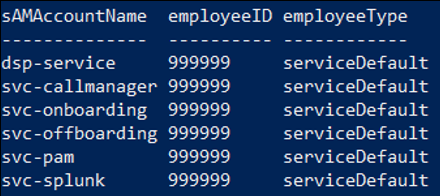

## Can you get me a list of all mail …

….. enabled service accounts and their manager as we need to enable MFA on these.

```powershell
Get-ADUser -Filter {(employeeID -eq "999999") -and (employeeType -eq “serviceMailEnabled")} 
-Properties employeeID,employeeType | Select-Object sAMAccountName, 
employeeID,employeeType 
```

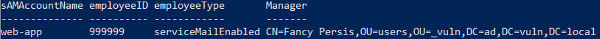

---

## Workflows

- **Manager validation:**
Every service account MUST have an owner, that owner is responsible for any and all actions taken by the account! If a manager is terminated, account validation triggers and the managers/manager + IT is notified a new manager is required for the account.
  - No manager = no account use.

- **Account validation:**
account owner (manager) responsible for annual/bi-annual account verification and organizing password reset/change; if they don’t the account is disabled!

---

## Retiring Service Accounts

### Retiring old service accounts

To minimize the impact in environments of accidental disablement of accounts, the retirement of accounts must be planned to allow quick remediation should any issues occur, an example plan may look like the below:

- Disable the account in situ
- Wait 7 days
- Move the account to a restricted OU in Active Directory (denies logon and NOT Entra ID synchronized)
- Wait 7 days
- Remove permissions from the account (any groups/delegations)
- Wait 7 days
- Delete the account

---
